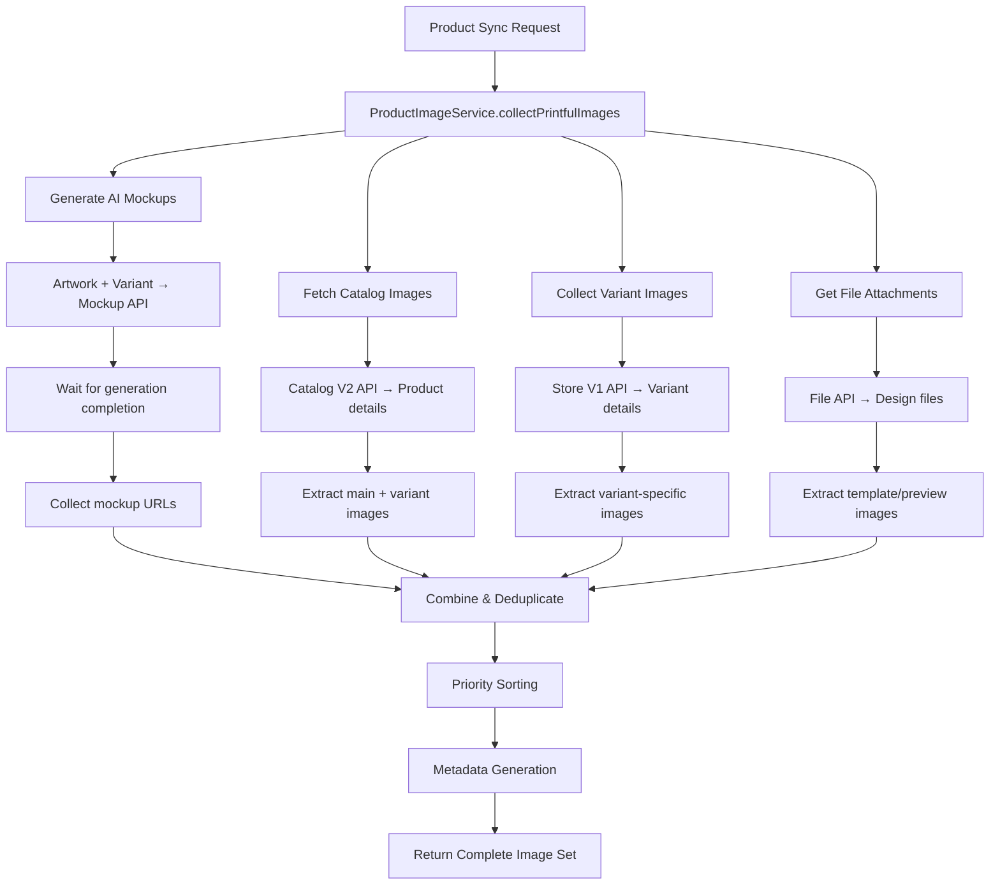

# Image Handling System - SenCommerce

## Overview

This document outlines the **consolidated image handling system** for SenCommerce that collects comprehensive image sets from Printful POD (Print on Demand) services and imports them into Medusa products.

## ✅ Current Implementation Status

- ✅ **Consolidated Pipeline**: Single robust image collection service
- ✅ **Multiple Image Sources**: AI mockups, catalog images, variant images, file attachments
- ✅ **Error Handling**: Robust fallbacks and logging
- ✅ **Performance Optimized**: Efficient caching and deduplication
- ✅ **Frontend Integration**: Proper image display with type indicators

## Image Collection Architecture

### **Primary Service: ProductImageService**

Located: `sen-commerce/src/services/product-image-service.ts`

**Purpose**: Centralized service for collecting all available images from Printful POD services

**Key Method**: `collectPrintfulImages()`

### **Image Sources Collected**

#### **1. AI-Generated Mockups** 🎨
- **Source**: Printful Mockup Generation API
- **Count**: Up to 8 mockups per product
- **Content**: Product worn/used in realistic settings
- **Generation**: Automatic based on artwork + product variants
- **Priority**: Highest (displayed first)

#### **2. High-Definition Catalog Images** 📸
- **Source**: Printful Catalog V2 API  
- **Content**: Professional product photography
- **Quality**: High-resolution catalog images
- **Variants**: Different angles, colors, styles
- **Priority**: High (displayed after mockups)

#### **3. Variant-Specific Images** 🎯
- **Source**: Printful Store V1 API
- **Content**: Color/size specific product images
- **Variants**: Each product variant's specific image
- **Priority**: Medium (for variant selection)

#### **4. File Attachment Images** 📁
- **Source**: Printful File API
- **Content**: Design templates, overlays, detailed views
- **Types**: Design files, template previews, technical drawings
- **Priority**: Low (for detailed information)

## Image Processing Flow



## Image Metadata & Organization

### **Image Source Tracking**
```typescript
interface ImageCollection {
  images: Array<{
    url: string
    type: 'mockup' | 'catalog' | 'variant' | 'file_attachment'
    source: string
    priority: number
  }>
  thumbnail: string
  metadata: {
    total_images: number
    image_sources: {
      mockups: number      // AI-generated mockups
      catalog: number      // HD catalog images  
      variants: number     // Variant-specific images
      user_uploads: number // File attachments
    }
    image_source_details: Array<{
      url: string
      type: 'mockup' | 'catalog' | 'variant' | 'user_upload'
      source: string
    }>
  }
}
```

### **Frontend Display Integration**

```typescript
// Product page displays images with type indicators
{product.images.map((image, index) => {
  // Determine image type from metadata
  const imageType = getImageTypeFromMetadata(image.url, product.metadata)
  
  return (
    
    {/* Image type indicators */}
    {imageType === 'mockup' && <Badge>AI</Badge>}
    {imageType === 'catalog' && <Badge>HD</Badge>}
    {imageType === 'variant' && <Badge>VAR</Badge>}
    {imageType === 'user_upload' && <Badge>+</Badge>}
  )
})}
```

## Database Schema Integration

### **Printful Product Table**
```sql
-- Enhanced schema supports comprehensive image collection
ALTER TABLE printful_product 
ADD COLUMN additional_images TEXT[],           -- Array of all image URLs
ADD COLUMN metadata JSONB DEFAULT '{}';       -- Image source metadata

-- Indexes for performance
CREATE INDEX idx_printful_product_images ON printful_product USING GIN(additional_images);
CREATE INDEX idx_printful_product_metadata ON printful_product USING GIN(metadata);
```

### **Image Source Metadata Example**
```json
{
  "total_images": 12,
  "image_sources": {
    "mockups": 8,
    "catalog": 2, 
    "variants": 1,
    "user_uploads": 1
  },
  "image_source_details": [
    {
      "url": "https://files.cdn.printful.com/mockup/xyz123.jpg",
      "type": "mockup",
      "source": "generated"
    },
    {
      "url": "https://files.cdn.printful.com/catalog/abc456.jpg", 
      "type": "catalog",
      "source": "printful_catalog_v2"
    }
  ]
}
```

## Performance Optimizations

### **Deduplication Strategy**
- **URL-based deduplication**: Removes identical image URLs
- **Content-hash comparison**: Identifies similar images (future)
- **Priority preservation**: Maintains source priority order

### **Caching Mechanisms**
- **API Response Caching**: Reduces redundant Printful API calls
- **Image URL Validation**: Checks image accessibility before inclusion
- **Batch Processing**: Handles multiple products efficiently

### **Image Limits**
- **Maximum mockups**: 8 per product (to avoid overwhelming)
- **Maximum total images**: 20 per product (performance balance)
- **Fallback handling**: Graceful degradation if limits exceeded

## Sync Process Integration

### **Product Import Flow**
```typescript
// sen-commerce/src/api/admin/product-sync/route.ts
export async function POST(request: Request) {
  // 1. Get Printful product data
  const printfulProduct = await printfulService.getProduct(productId)
  
  // 2. Collect comprehensive images using ProductImageService
  const imageService = new ProductImageService(request)
  const imageCollection = await imageService.collectPrintfulImages(
    printfulProduct,
    artworkUrl,
    8,  // max mockups
    20  // max total images
  )
  
  // 3. Convert to Medusa format
  const medusaImageData = imageService.convertToMedusaFormat(imageCollection)
  
  // 4. Create Medusa product with complete image set
  const medusaProduct = await productService.create({
    title: printfulProduct.name,
    description: printfulProduct.description,
    thumbnail: medusaImageData.thumbnail,
    images: medusaImageData.images,
    metadata: {
      ...medusaImageData.metadata,
      printful_product_id: printfulProduct.id,
      artwork_url: artworkUrl,
      fulfillment_type: "printful_pod"
    }
  })
}
```

## Error Handling & Fallbacks

### **Robust Error Recovery**
```typescript
// ProductImageService error handling
async collectPrintfulImages(product, artwork, maxMockups, maxImages) {
  const results = {
    images: [],
    thumbnail: product.thumbnail_url,
    metadata: { total_images: 0, image_sources: {} }
  }
  
  try {
    // Try comprehensive collection
    const mockups = await this.generateMockups(product, artwork)
    const catalog = await this.fetchCatalogImages(product)
    const variants = await this.collectVariantImages(product)
    
    // Combine with fallbacks
    results.images = this.combineAndPrioritize(mockups, catalog, variants)
    
  } catch (error) {
    console.warn('Comprehensive collection failed, using fallbacks:', error)
    
    // Fallback: Use basic product images
    results.images = [
      { url: product.thumbnail_url, type: 'basic' }
    ].filter(Boolean)
  }
  
  return results
}
```

### **Fallback Priority**
1. **Primary**: Comprehensive image collection from all sources  
2. **Secondary**: Basic product thumbnail + available variants
3. **Tertiary**: Product thumbnail only
4. **Final**: Placeholder image (if configured)

## Frontend Integration Features

### **Image Gallery with Type Indicators**
- **AI Badge**: Blue badge for AI-generated mockups
- **HD Badge**: Purple badge for high-definition catalog images  
- **VAR Badge**: Orange badge for variant-specific images
- **+ Badge**: Green badge for custom/user-uploaded content

### **Progressive Loading**
- **Thumbnail first**: Shows product thumbnail immediately
- **Progressive enhancement**: Loads additional images progressively
- **Lazy loading**: Images load as user scrolls/interacts

### **Image Source Summary**
```typescript
// Displays image collection summary
<div className="image-collection-summary">
  <span>{metadata.image_sources.mockups} AI Generated</span>
  <span>{metadata.image_sources.catalog} High-Def</span>
  <span>{metadata.image_sources.variants} Variants</span>
  <span>{metadata.image_sources.user_uploads} Custom</span>
  <span>Total: {metadata.total_images} images</span>
</div>
```

## Architecture Benefits

### **Single Responsible Service**
- ✅ **Consolidated logic**: All image collection in ProductImageService
- ✅ **Consistent interface**: Same API for all image sources
- ✅ **Easy maintenance**: Single point of control and updates
- ✅ **Testable**: Isolated service with clear responsibilities

### **Comprehensive Coverage**  
- ✅ **All image sources**: No missed images from any Printful API
- ✅ **Rich metadata**: Full tracking of image sources and types
- ✅ **Quality prioritization**: Best images displayed first
- ✅ **Efficient deduplication**: No duplicate images stored

### **Performance & Reliability**
- ✅ **Smart caching**: Reduces API calls and improves speed
- ✅ **Graceful degradation**: Works even if some sources fail
- ✅ **Resource limits**: Prevents overwhelming with too many images
- ✅ **Error boundaries**: Individual source failures don't break entire process

## Monitoring & Analytics

### **Image Collection Metrics**
- **Success rate**: Percentage of successful comprehensive collections
- **Source performance**: Success rate per image source (mockups, catalog, variants)
- **Average images per product**: Distribution of image counts
- **API response times**: Performance of different Printful APIs

### **Error Tracking**
- **Collection failures**: When comprehensive collection fails completely
- **Partial failures**: When some image sources fail but others succeed
- **API timeouts**: Tracking Printful API reliability
- **Invalid images**: URLs that fail validation or loading

## Future Enhancements

### **Planned Improvements**
- 🖼️ **Image optimization**: Automatic resizing and format conversion
- 🎯 **Smart cropping**: AI-powered image cropping for better display
- 📊 **A/B testing**: Test different image arrangements for conversion
- 🌐 **CDN integration**: Global image distribution for faster loading

### **Advanced Features**
- 🔍 **Visual similarity detection**: Identify and remove similar images
- 🎨 **Style transfer**: Apply consistent styling to product images
- 📱 **Responsive images**: Generate multiple sizes for different devices
- 🏷️ **Auto-tagging**: AI-powered image content tagging

---

## Summary

The SenCommerce image handling system provides a **comprehensive, reliable solution** for collecting and managing product images from Printful POD services:

- 🎯 **Complete Coverage**: Collects all available images from all Printful APIs
- 🏎️ **High Performance**: Efficient caching, deduplication, and resource limits  
- 🛡️ **Robust Reliability**: Graceful error handling and fallback strategies
- 🎨 **Rich Metadata**: Full tracking of image sources, types, and priorities
- 💡 **Developer Friendly**: Single service interface with clear responsibilities

The system ensures **maximum image availability** for products while maintaining **optimal performance** and **reliable operation** even when individual image sources fail.