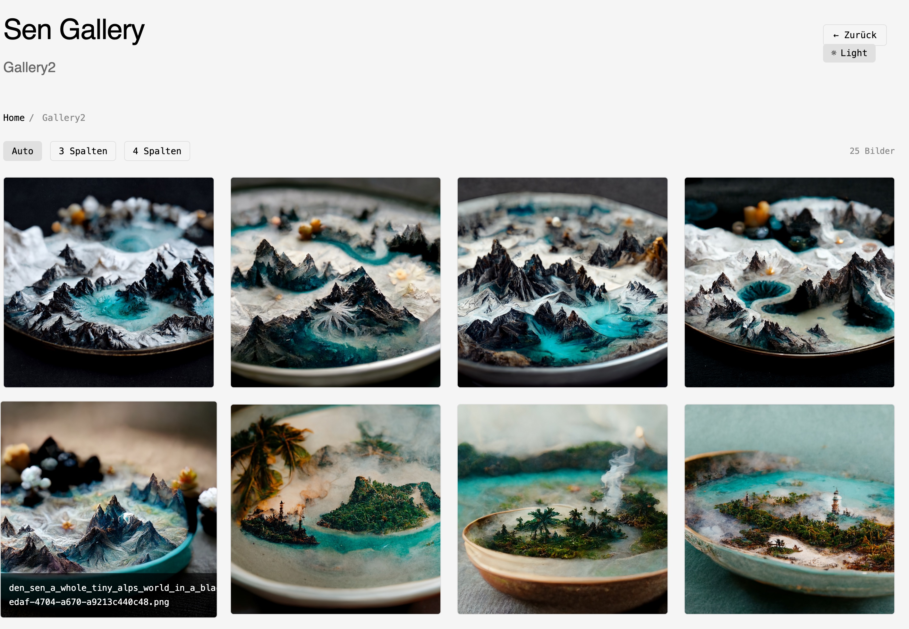
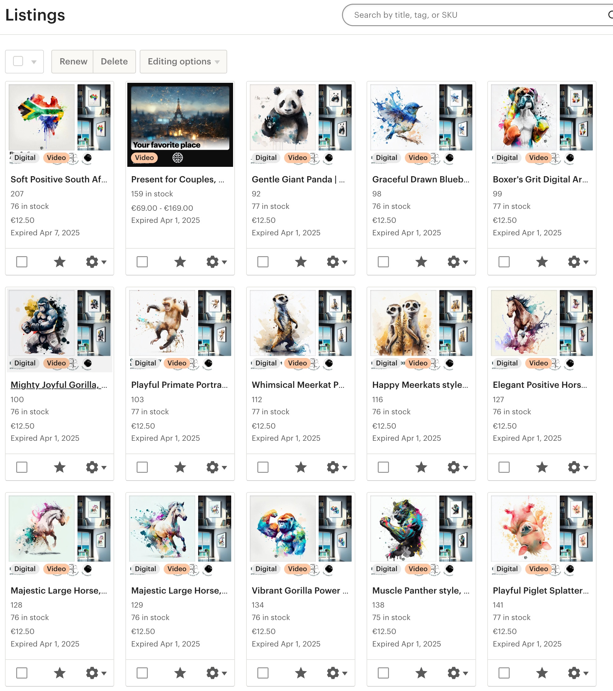
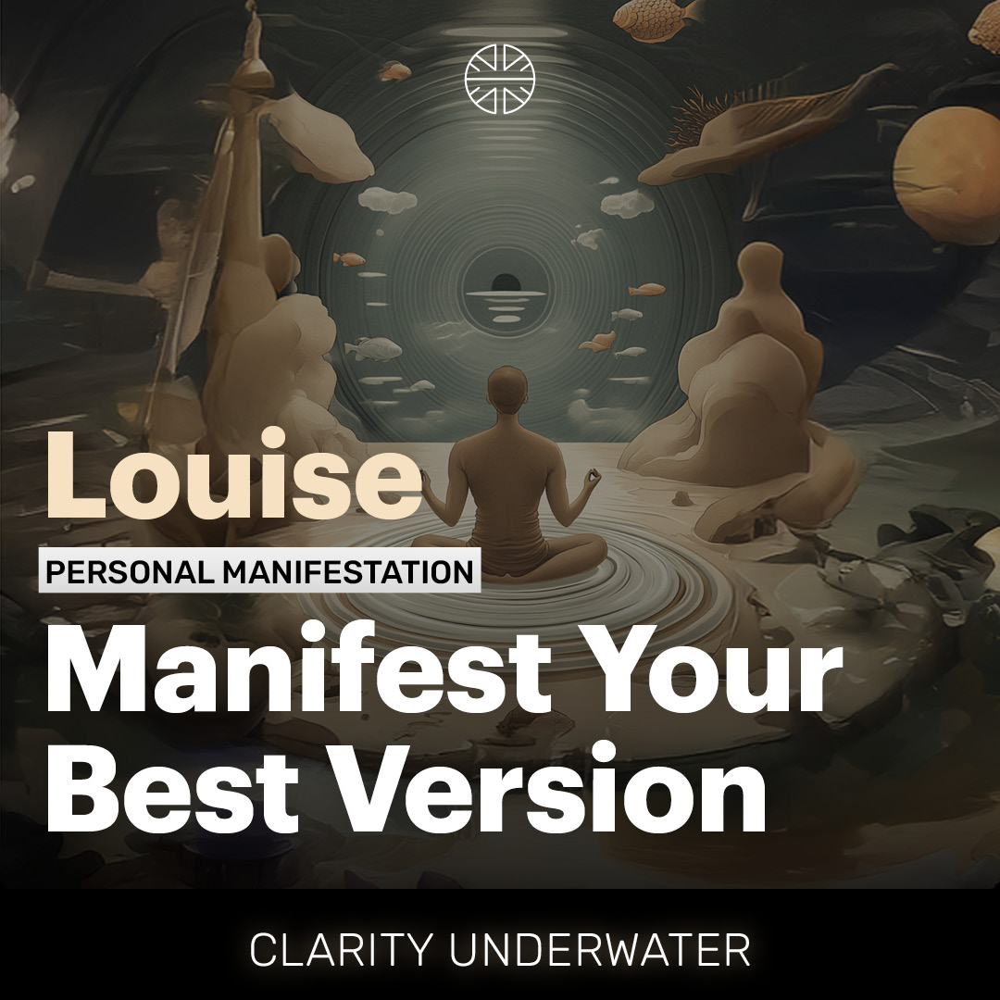

<!-- Project Badges -->
<p align="center">
  <a href="https://nextjs.org/"></a>
  <a href="https://react.dev/"></a>
  <a href="https://medusajs.com/"></a>
  <a href="https://stripe.com/"></a>
  <a href="https://tailwindcss.com/"></a>
  <a href="https://vercel.com/"></a>
</p>

# SenShop Commerce

[**Full Idea Statement (PDF) →**](concept/SenShop_idea_statement.pdf)

---

## 🚀 Live Demo

**Check it out live:** [https://commerce.sen.studio](https://commerce.sen.studio)

---

## 🛠️ Tech Stack
- Next.js
- React
- Medusa
- Stripe
- Tailwind CSS
- Vercel (Deployment)
- Printful / Gelato (POD)

---

## 📦 Project Structure
```text
Home
├── About
├── Collections
│   ├── [Collection Overview Page]
│   │   ├── Story / Theme
│   │   └── Artworks Grid
│   └── [Artwork Page]
│       ├── Artwork Details
│       ├── Image Preview
│       ├── Purchase Options
│       │   ├── Download
│       │   ├── Print
│       │   ├── Framed
│       │   └── Apparel
│       └── Add to Cart
├── Exhibitions (Optional)
├── Search / Filter
├── Cart
├── Checkout (Stripe)
├── My Orders / Downloads
└── Legal
    ├── Terms
    ├── Privacy
    └── Imprint
```

---

## 🖼️ Example Artworks
<p align="center">
  
  
  
</p>

---

## ▲ Deployed on Vercel


> **Live URL:** [https://commerce.sen.studio](https://commerce.sen.studio)

---

<details>
<summary>📖 <strong>Project Details & User Flow</strong></summary>

# Idea Statement

This project is a curated e-commerce experience built on React and Medusa. Users browse digital art exhibitions and themed collections. Each artwork can be purchased as a digital download or physical product (framed print, apparel) fulfilled by Print-on-Demand partners like Printful or Gelato. The shopping experience focuses on storytelling, visual exploration, and easy checkout via Stripe with automated invoice generation. 

### User Flow
1. Browse by collection or exhibition
2. Dive into a specific artwork
3. Choose purchase format:
   - Digital Download
   - Framed Print
   - T-Shirt / Apparel
4. Checkout with Stripe
5. Auto-generated invoice + delivery via POD

</details>

---

## 📋 Working Plan

### 1. Backend Development

#### Priority 1: Artwork Module
- Build artwork database schema
- Create CRUD operations for artworks
- Link artworks to products and collections
- Implement artwork metadata (title, description, year, version, etc.)
- Add image management and optimization

#### Priority 2: Core Backend Services
- **Stripe Integration**
  - Payment processing setup
  - Webhook handlers for payment events
  - Invoice generation automation
  - Refund handling
  
- **User Authentication & Management**
  - JWT authentication system
  - User registration/login
  - Password reset functionality
  - User profile management
  
- **Order Management**
  - Order processing workflow
  - Order status tracking
  - Email notifications
  - Order history API#

#### Priority 3: Integration Services
- **Printful API v2 Integration**
  - Connect product catalog with Printful API v2
  - Sync product variants and pricing
  - Handle order fulfillment automation
  
- **Digital Downloads Module**
  - Implement secure download links generation
  - Add download tracking and limits
  - Create digital asset management system
  
- **Email Service**
  - Transactional emails (order confirmation, shipping updates)
  - Email templates
  - Integration with email provider (SendGrid/Postmark)

### 2. Frontend Development
- **Single Page Components**
  - Artwork detail page with zoom functionality
  - Collection gallery with lazy loading
  - Shopping cart with real-time updates
  - Checkout flow with Stripe integration
  - Order confirmation and download page
  - User dashboard for order history
  - Search and filter functionality
  - Mobile-responsive navigation