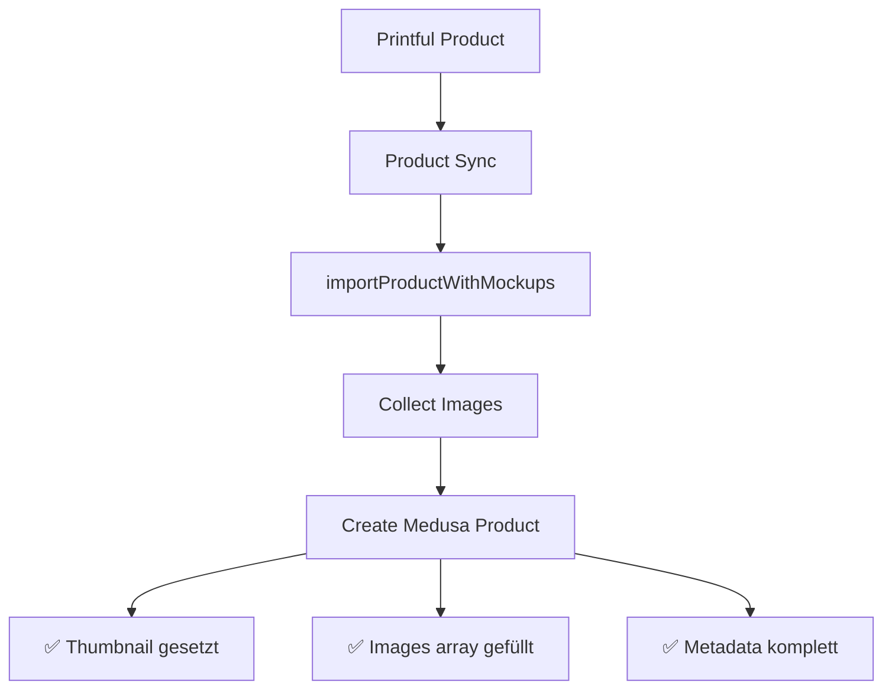

# Medusa Product Import/Create/Edit Flow Overview

## 🏗️ Architektur Übersicht

### Image Handling Problem
**KRITISCH:** Bilder werden derzeit als **Printful URLs gespeichert**, nicht in Medusa DB kopiert!
- Pro: Schneller Import, keine Speicherkosten
- Contra: Abhängigkeit von Printful CDN, keine Kontrolle über Verfügbarkeit

## 📁 Wichtige Files für Mentor-Besprechung

### 1. Product Creation/Import Routes
```
📂 src/api/
├── 📄 admin/products/route.ts (Zeilen 188-237)
│   └── POST: Manuelle Produkt-Erstellung aus Admin UI
│       Problem: Bilder werden jetzt hinzugefügt, aber nur als URLs
│
└── 📄 store/admin-product-sync/route.ts (Zeilen 286-308)
    └── importProducts(): Bulk-Import von Printful
        Problem: KEINE Bilder werden importiert!
```

### 2. Printful Integration Service
```
📂 src/modules/printful/services/
└── 📄 printful-pod-product-service.ts
    ├── importProductWithMockups() (Zeile 456-530)
    │   └── Sammelt bis zu 15 Bilder (Mockups + Catalog + Variants)
    │
    └── generateAndWaitForMockups() (Zeile 423-453)
        └── Generiert Mockups mit Artwork über Printful API
```

### 3. Product Display/Query
```
📂 src/api/
├── 📄 admin/products/route.ts (Zeilen 45-133)
│   └── GET: Produkt-Liste mit Thumbnail-Extraktion
│       Fallback-Reihenfolge:
│       1. product.thumbnail
│       2. metadata.original_thumbnail
│       3. images[0].url
│       4. variants[0].images[0]
│
└── 📄 store/products/[id]/route.ts
    └── GET: Einzelprodukt mit Pricing
```

## 🔄 Product Import Flow

### Aktueller Flow (PROBLEMATISCH)

```mermaid
graph TD
    A[Printful Product] --> B[Product Sync UI]
    B --> C[/store/admin-product-sync]
    C --> D[Create Medusa Product]
    D --> E[❌ KEINE Bilder]
    D --> F[❌ Nur Metadata]
```

### Gewünschter Flow



## 🖼️ Image Storage Analyse

### Aktuelle Implementierung
1. **URLs werden direkt gespeichert**
   ```typescript
   images: productImages.map(url => ({ url }))
   ```
   - Bilder bleiben auf Printful CDN
   - Format: `https://files.cdn.printful.com/files/...`

2. **Keine lokale Kopie**
   - Medusa speichert nur die URL-Referenzen
   - Kein Download/Upload zu eigenem Storage

### Potenzielle Probleme
- ⚠️ **Verfügbarkeit**: Printful kann URLs ändern/löschen
- ⚠️ **Performance**: Externe CDN-Abhängigkeit
- ⚠️ **GDPR/Kontrolle**: Keine Kontrolle über Datenspeicherung

## 🔧 Erforderliche Fixes

### 1. Fix Product Sync Import
**File:** `/src/api/store/admin-product-sync/route.ts:286-308`

```typescript
// AKTUELL (FALSCH):
medusaProduct = await productModuleService.createProducts({
  title: printfulProduct.name,
  description: printfulProduct.description,
  status: "draft",
  metadata: { ... }
  // ❌ Keine Bilder!
})

// SOLLTE SEIN:
const productImages = [
  printfulProduct.thumbnail_url,
  ...printfulProduct.variants.map(v => v.image)
].filter(Boolean)

medusaProduct = await productModuleService.createProducts({
  title: printfulProduct.name,
  description: printfulProduct.description,
  thumbnail: productImages[0],  // ✅
  images: productImages.map(url => ({ url })),  // ✅
  status: "draft",
  metadata: { ... }
})
```

### 2. Verwende importProductWithMockups
**Besser:** Nutze die existierende Methode aus `printful-pod-product-service.ts`

```typescript
// In admin-product-sync/route.ts
const printfulService = req.scope.resolve("printfulModule")
const medusaProduct = await printfulService.importProductWithMockups(
  printfulProduct,
  artworkUrl // optional
)
```

## 💬 Diskussionspunkte mit Mentor

### 1. **Image Storage Strategie**
- Sollen Bilder lokal gespeichert werden?
- Eigener S3/Storage Provider?
- Kosten vs. Kontrolle Trade-off

### 2. **Sync Strategie**
- Bulk Import vs. Single Product Import
- Background Jobs für große Imports?
- Webhook Integration mit Printful?

### 3. **Currency Handling**
- EUR als Hauptwährung (bereits gefixt)
- Multi-Currency Support benötigt?
- Preiskonvertierung automatisieren?

### 4. **Error Handling**
- Was wenn Printful API down ist?
- Fallback für fehlende Bilder?
- Retry-Logik für Failed Imports?

## 📊 Status Zusammenfassung

| Feature | Status | Problem |
|---------|--------|---------|
| Manual Product Create | ✅ Fixed | Images jetzt inkludiert |
| Product Sync Import | ❌ Broken | Keine Bilder beim Import |
| Thumbnail Display | ✅ Fixed | 4-stufiges Fallback System |
| Currency | ✅ Fixed | EUR statt USD |
| Image Storage | ⚠️ Diskussion | Externe URLs vs. lokale Kopien |

## 🚀 Nächste Schritte

1. **Sofort:** Fix `/store/admin-product-sync` Import
2. **Diskussion:** Image Storage Strategie entscheiden
3. **Optional:** Batch Import UI verbessern
4. **Langfristig:** Webhook Integration für Auto-Sync