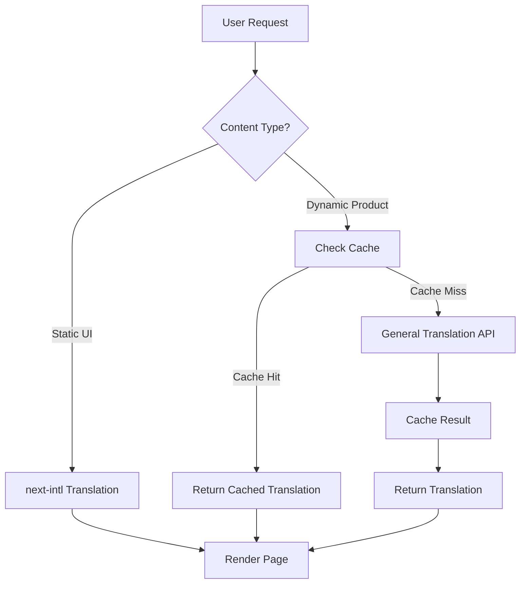

# Translation Architecture

## Overview

This document outlines the hybrid translation architecture for our e-commerce platform, designed to efficiently support multiple languages without database bloat while maintaining excellent user experience.

## Current Architecture

### Static Content Translation (next-intl)

The storefront uses **next-intl** for static UI element translations:

- **Location**: `sen-commerce-storefront/messages/`
- **Languages**: 23+ languages (en, fr, es, de, it, pt, nl, etc.)
- **Content Type**: Navigation, buttons, labels, static text
- **Implementation**: Traditional JSON-based translations with locale routing

```typescript
// Static content example
const t = useTranslations('navigation')
return <button>{t('addToCart')}</button>
```

### Database Content Challenge

Currently, product titles and descriptions are stored in English only:

```typescript
interface Product {
  id: string
  title: string        // English only
  description: string  // English only
  // ... other fields
}
```

**Problem**: To support 23 languages traditionally would require:
- 13x database storage increase
- Complex content management
- Synchronization challenges across languages

## Proposed Hybrid Architecture

### Solution: On-Demand Translation with General Translation

Implement **General Translation** for dynamic database content while keeping next-intl for static content.

#### Architecture Components

1. **Static UI Layer** (Existing - next-intl)
   - Navigation, buttons, forms, error messages
   - Pre-translated JSON files
   - Fast loading, no API calls

2. **Dynamic Content Layer** (New - General Translation)
   - Product titles, descriptions, user-generated content
   - Real-time AI translation
   - Contextual accuracy

3. **Caching Layer** (Performance Optimization)
   - Client-side translation cache
   - Redis/memory cache for server-side
   - Avoid re-translating same content

#### Implementation Flow



### Code Implementation Example

#### Product Display Component
```typescript
import { T, Var } from 'gt-react'
import { useTranslations } from 'next-intl'

export default function ProductCard({ product }: { product: Product }) {
  const t = useTranslations('products') // Static UI
  
  return (
    <div className="product-card">
      {/* Static UI - next-intl */}
      <button>{t('addToCart')}</button>
      <span>{t('price')}: {formatPrice(product.price)}</span>
      
      {/* Dynamic Content - General Translation */}
      <T>
        <h3><Var>{product.title}</Var></h3>
        <p><Var>{product.description}</Var></p>
      </T>
    </div>
  )
}
```

#### Translation Service Layer
```typescript
// Translation service abstraction
export class TranslationService {
  private cache = new Map<string, string>()
  
  async translateProduct(product: Product, locale: string) {
    const cacheKey = `${product.id}-${locale}`
    
    if (this.cache.has(cacheKey)) {
      return this.cache.get(cacheKey)
    }
    
    // General Translation API call would happen here
    // via the <T> component rendering
    
    return product // Fallback to original
  }
}
```

## Benefits of Hybrid Approach

### Performance Benefits
- **Fast Static Loading**: UI elements load instantly from JSON
- **Cached Dynamic Content**: Translated products cached after first load
- **Reduced Database Size**: Single language storage
- **Selective Translation**: Only translate visible content

### Maintenance Benefits
- **Single Source of Truth**: Product content stored once in database
- **Automatic Updates**: Content changes automatically available in all languages
- **No Sync Issues**: Eliminates translation versioning problems
- **Developer Friendly**: Simple implementation, minimal code changes

### User Experience Benefits
- **Consistent UI**: Static elements always in user's language
- **Contextual Translations**: AI understands product context for better accuracy
- **Real-time Support**: New products immediately available in all languages
- **Fallback Strategy**: Graceful degradation to English if translation fails

## Implementation Phases

### Phase 1: Foundation Setup
- [ ] Install and configure General Translation
- [ ] Create translation service wrapper
- [ ] Implement basic caching mechanism
- [ ] Test with single product component

### Phase 2: Product Integration
- [ ] Convert product title/description components
- [ ] Implement translation caching
- [ ] Add loading states and error handling
- [ ] Performance testing and optimization

### Phase 3: Extended Content
- [ ] Category descriptions
- [ ] Collection information
- [ ] User reviews/comments (if applicable)
- [ ] SEO metadata translation

### Phase 4: Optimization
- [ ] Advanced caching strategies
- [ ] Translation preloading for popular products
- [ ] Analytics and performance monitoring
- [ ] A/B testing different translation approaches

## Technical Configuration

### Dependencies
```json
{
  "gt-react": "^latest",
  "gt-next": "^latest", 
  "next-intl": "^3.0.0" // Keep existing
}
```

### Environment Variables
```env
# General Translation API
GT_API_KEY=your_api_key
GT_PROJECT_ID=your_project_id

# Existing next-intl config
NEXT_INTL_DEFAULT_LOCALE=en
```

### File Structure
```
sen-commerce-storefront/
├── i18n/
│   ├── request.ts          # next-intl config
│   └── translation.ts      # General Translation config
├── messages/
│   ├── en.json            # Static UI translations
│   ├── fr.json
│   └── ...
├── components/
│   ├── ProductCard.tsx    # Hybrid translation example
│   └── TranslationProvider.tsx
└── lib/
    └── translation-service.ts
```

## Monitoring and Analytics

### Translation Metrics
- Translation hit/miss ratios
- Response times for dynamic translations
- Cache efficiency
- User language preferences

### Performance Monitoring  
- Page load times by language
- Translation API response times
- Cache memory usage
- Error rates and fallback usage

## Migration Strategy

1. **Gradual Implementation**: Start with high-traffic products
2. **A/B Testing**: Compare performance with current approach
3. **Fallback Support**: Ensure English fallback always works
4. **User Feedback**: Monitor user experience across languages

## Future Considerations

### Potential Enhancements
- **AI Translation Training**: Custom models for domain-specific terminology
- **Translation Review Workflow**: Human review for critical content
- **Multi-vendor Support**: Fallback to other translation services
- **Offline Translation**: Pre-generate translations for critical content

### Scalability Planning
- **CDN Integration**: Distribute translated content globally
- **Microservice Architecture**: Separate translation service
- **Database Optimization**: Efficient caching and indexing strategies

---

*This architecture provides a scalable, maintainable solution for multilingual e-commerce while optimizing for both performance and developer experience.*